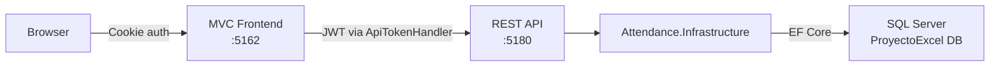
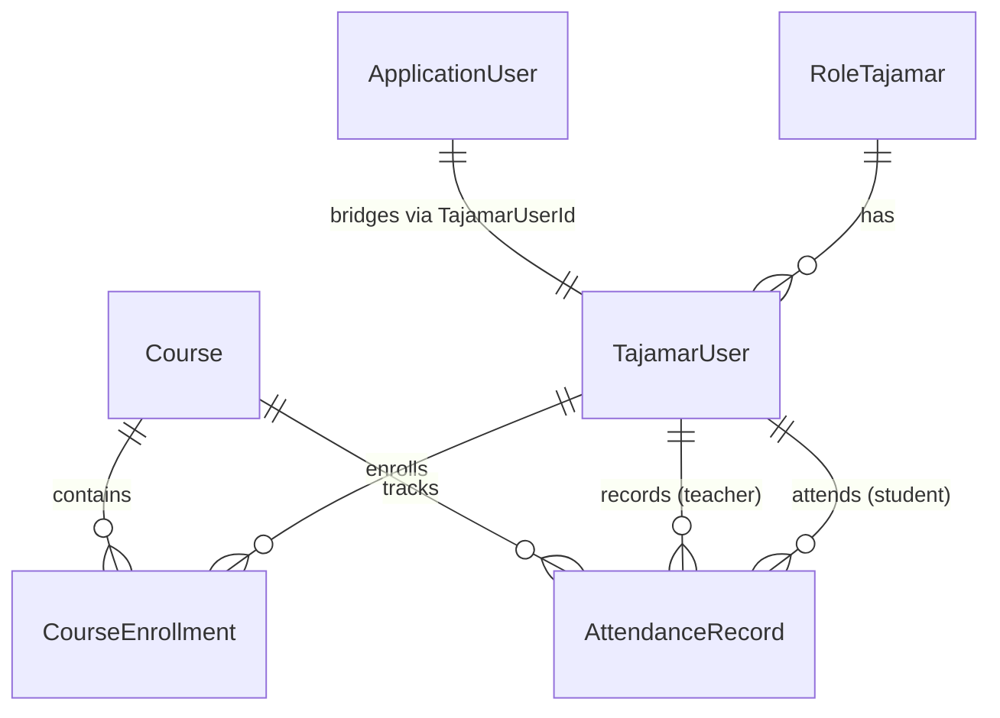

# Context — Attendance Management System (Tajamar)

Web application for tracking course attendance at Tajamar, with Excel-compatible metrics (present/absent/late, diploma eligibility, drop risk). Built with .NET 10 and SQL Server.

For full setup instructions, test accounts, and troubleshooting see [README.md](README.md).

---

## Solution layout

| Project | Folder | Role | Port |
|---------|--------|------|------|
| **ApiProyectoExcel** | `ApiProyectoExcel/` | REST API, JWT authentication, OpenAPI + Scalar docs | `5180` |
| **MvcProyectoExcel** | `ProyectoExcel/` | ASP.NET Core MVC frontend, cookie authentication | `5162` |
| **Attendance.Infrastructure** | `Attendance.Infrastructure/` | Shared class library: EF Core, entities, DTOs, services | — |

Both web projects reference `Attendance.Infrastructure`. The MVC app never touches the database directly — it calls the API over HTTP.

---

## Architecture

**Authentication flow:**

1. User logs in via the MVC app (`/Account/Login`).
2. MVC calls `POST /api/auth/login` on the API and receives a JWT.
3. The JWT is stored in an HttpOnly cookie (`ApiJwt`) and a cookie-based `ClaimsIdentity` is created for the MVC session.
4. On every subsequent API call, `ApiTokenHandler` (a `DelegatingHandler`) reads the cookie and attaches the JWT as a `Bearer` token.

**Roles:** `Admin`, `Teacher`, `Student` — mapped from legacy Tajamar roles (`ADMINISTRADOR`, `PROFESOR`, `ALUMNO`).

---

## Domain model

All entities live in `Attendance.Infrastructure/Entities/`:

| Entity | SQL Table | Notes |
|--------|-----------|-------|
| `TajamarUser` | `USUARIOSTAJAMAR` | Students, teachers, admins |
| `RoleTajamar` | `ROLESCHARLASTAJAMAR` | Legacy role lookup |
| `Course` | `CURSOSTAJAMAR` | Courses with start/end dates |
| `CourseEnrollment` | `CURSOSUSUARIOSTAJAMAR` | Many-to-many join |
| `AttendanceRecord` | `ASISTENCIATAJAMAR` | One record per student per course per day |
| `AttendanceStatus` | *(enum)* | Present(0), Absent(1), Late(2), JustifiedAbsent(3), JustifiedLate(4), EarlyLeave(5), JustifiedEarlyLeave(6) |
| `ApplicationUser` | ASP.NET Identity tables | Extends `IdentityUser` with `TajamarUserId` FK |

Entity properties use English names; SQL column mapping is done via `.HasColumnName()` in the Fluent API.

---

## Data access

- **DbContext:** `ApplicationDbContext` extends `IdentityDbContext<ApplicationUser>`. Configured in `Attendance.Infrastructure/Data/ApplicationDbContext.cs`.
- **Legacy tables** use `ExcludeFromMigrations()` — EF Core reads/writes them but never alters their schema. Only ASP.NET Identity tables are managed by migrations.
- **No repository layer.** Services inject `ApplicationDbContext` directly and query with LINQ.
- **DbInitializer** (`Attendance.Infrastructure/Data/DbInitializer.cs`): runs migrations on API startup, seeds Identity roles and user accounts from the legacy `USUARIOSTAJAMAR` table.

---

## Service layer

All services live in `Attendance.Infrastructure/Services/` with interface + implementation pairs, registered as scoped (except `PdfExportService` which is singleton):

| Service | Purpose |
|---------|---------|
| `AuthService` / `JwtTokenService` | Identity login, JWT creation |
| `CourseService` | Course listing, student roster |
| `AttendanceService` | Session CRUD, student records/summaries, dev seeding |
| `StatisticsService` | Course-level stats, rankings, filtering |
| `PdfExportService` | PDF generation via QuestPDF |
| `AttendanceMetricsCalculator` | Pure calculation: attendance %, diploma eligibility (≥80%), drop risk (<75%) |
| `LectiveDayCalendar` | Weekday-only academic calendar, 156 lective days/year |

DI registration is centralized in `Attendance.Infrastructure/Extensions/ServiceCollectionExtensions.cs` via `AddAttendanceInfrastructure()`.

---

## MVC client layer

The MVC project never accesses the database. Instead it uses:

- **`IAttendanceApiClient`** / `AttendanceApiClient` (`ProyectoExcel/Services/AttendanceApiClient.cs`) — a typed `HttpClient` wrapping every API endpoint.
- **`ApiTokenHandler`** (`ProyectoExcel/Services/ApiTokenHandler.cs`) — a `DelegatingHandler` that reads the JWT from the `ApiJwt` cookie and injects it as a Bearer token on outgoing requests.

MVC controllers build ViewModels from DTO responses and pass them to Razor views.

---

## Frontend

- **CSS framework:** Bootstrap 5 with built-in dark mode (`data-bs-theme` attribute).
- **Icons:** Bootstrap Icons (CDN).
- **JS libraries:** jQuery (DOM), Chart.js (statistics charts), jQuery Validation.
- **Custom files:** `wwwroot/css/site.css` (styles, dark mode overrides), `wwwroot/js/site.js` (dark mode toggle, alert auto-dismiss).
- **Localization:** Spanish (default) and English via `.resx` resource files in `ProyectoExcel/Resources/`. Language switching via `CultureController` and a navbar dropdown.
- **Layout:** Single shared layout at `Views/Shared/_Layout.cshtml` with role-based navigation.

---

## Key conventions

- DTOs are immutable `record` types in `Attendance.Infrastructure/DTOs/`.
- ViewModels are classes in `ProyectoExcel/ViewModels/`.
- Services use **primary constructor DI** (e.g., `public class AttendanceService(ApplicationDbContext dbContext)`).
- All async methods propagate `CancellationToken`.
- Read queries use `AsNoTracking()`.
- API errors return `{ message: "..." }` JSON.
- Role-based authorization via `[Authorize(Roles = "...")]`.
