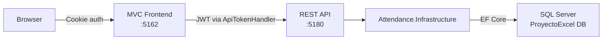
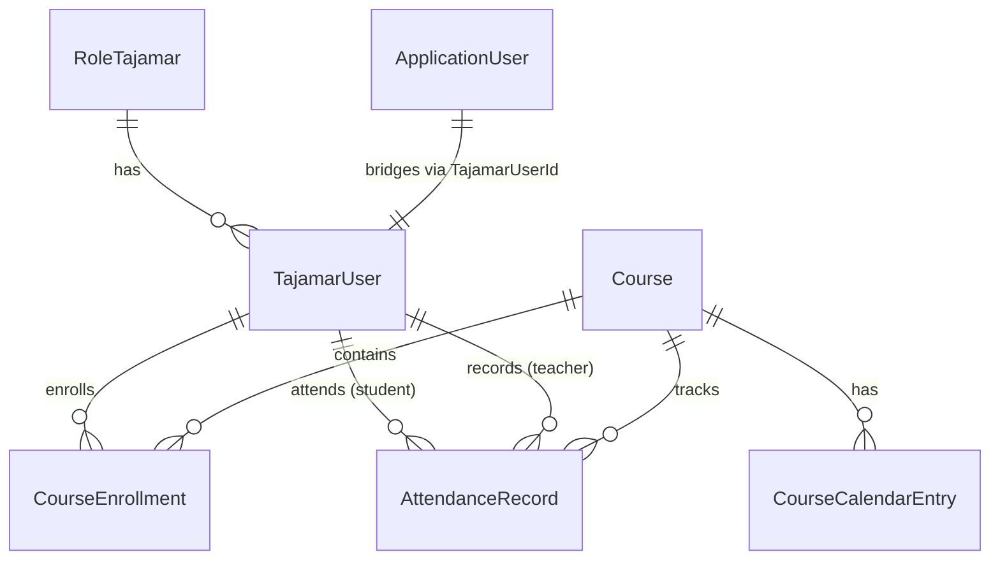
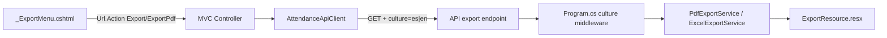

# Context — Attendance Management System (Tajamar)

Web application for tracking course attendance at Tajamar, with Excel-compatible metrics (present/absent/late, diploma eligibility, drop risk). Built with .NET 10 and SQL Server.

For full setup instructions, test accounts, and troubleshooting see [README.md](README.md).
Coding and agent rules: [AGENTS_Alvaro.md](AGENTS_Alvaro.md).

---

## Solution layout

| Project | Folder | Role | Port |
|---------|--------|------|------|
| **ApiProyectoExcel** | `ApiProyectoExcel/` | REST API, JWT authentication, OpenAPI + Scalar docs | `5180` |
| **MvcProyectoExcel** | `ProyectoExcel/` | ASP.NET Core MVC frontend, cookie authentication | `5162` |
| **Attendance.Infrastructure** | `Attendance.Infrastructure/` | Shared class library: EF Core, entities, DTOs, services | — |

Both web projects reference `Attendance.Infrastructure`. The MVC app never touches the database directly — it calls the API over HTTP.

---

## Architecture

**Authentication flow:**

1. User logs in via the MVC app (`/Account/Login`) — enters email local part only; controller appends `@tajamar365.com`.
2. MVC calls `POST /api/auth/login` on the API and receives a JWT.
3. The JWT is stored in an HttpOnly cookie (`ApiJwt`) and a cookie-based `ClaimsIdentity` is created for the MVC session.
4. On every subsequent API call, `ApiTokenHandler` (a `DelegatingHandler`) reads the cookie and attaches the JWT as a `Bearer` token.

**Roles:** `Admin`, `Teacher`, `Student` — mapped from legacy Tajamar roles (`ADMINISTRADOR`, `PROFESOR`, `ALUMNO`).

---

## Domain model

All entities live in `Attendance.Infrastructure/Entities/`:

| Entity | SQL Table | Notes |
|--------|-----------|-------|
| `TajamarUser` | `USUARIOSTAJAMAR` | Students, teachers, admins |
| `RoleTajamar` | `ROLESCHARLASTAJAMAR` | Legacy role lookup |
| `Course` | `CURSOSTAJAMAR` | Courses with start/end dates |
| `CourseEnrollment` | `CURSOSUSUARIOSTAJAMAR` | Many-to-many join |
| `AttendanceRecord` | `ASISTENCIATAJAMAR` | One record per student per course per day |
| `CourseCalendarEntry` | `CALENDARIOCURSO` | Dynamic course academic calendar dates (EF-managed) |
| `AttendanceStatus` | *(enum)* | See enum table below |
| `ApplicationUser` | ASP.NET Identity tables | Extends `IdentityUser` with `TajamarUserId` FK |

Entity properties use English names; SQL column mapping is done via `.HasColumnName()` in the Fluent API.

**AttendanceStatus enum:**

| Value | Name | Display code |
|-------|------|--------------|
| 0 | `Present` | — |
| 1 | `Absent` | F |
| 2 | `Late` | R |
| 3 | `JustifiedAbsent` | FJ |
| 4 | `JustifiedLate` | RJ |
| 5 | `EarlyLeave` | SAF |
| 6 | `JustifiedEarlyLeave` | SAFJ |

---

## Data access

- **DbContext:** `ApplicationDbContext` extends `IdentityDbContext<ApplicationUser>`. Configured in `Attendance.Infrastructure/Data/ApplicationDbContext.cs`.
- **Legacy tables** use `ExcludeFromMigrations()` — EF Core reads/writes them but never alters their schema. Only ASP.NET Identity tables and `CALENDARIOCURSO` are managed by migrations.
- **No repository layer.** Services inject `ApplicationDbContext` directly and query with LINQ.
- **DbInitializer** (`Attendance.Infrastructure/Data/DbInitializer.cs`): runs migrations on API startup, seeds Identity roles and user accounts from the legacy `USUARIOSTAJAMAR` table.

---

## Service layer

All services live in `Attendance.Infrastructure/Services/` with interface + implementation pairs. Scoped by default; export services are singletons:

| Service | Purpose |
|---------|---------|
| `AuthService` / `JwtTokenService` | Identity login, JWT creation |
| `CourseService` | Course listing, student roster |
| `AttendanceService` | Session CRUD, student records/summaries, dev seeding |
| `StatisticsService` | Course-level stats, rankings, filtering |
| `AttendanceMetricsCalculator` | Pure calc: attendance %, diploma eligibility (≥80%), warning (<85%), drop risk (<75%) |
| `LectiveDayCalendar` | Weekday-only academic calendar, 156 lective days/year (fallback when no custom calendar) |
| `CalendarParserService` | Parses uploaded calendar Excel spreadsheets (.xlsx) using ClosedXML |
| `CalendarService` | Database operations for custom course calendars |
| `ExcelExportService` | Statistics export to .xlsx via ClosedXML; localized via `ExportResource` |
| `PdfExportService` | PDF generation via QuestPDF; localized via `ExportResource` |

DI registration is centralized in `Attendance.Infrastructure/Extensions/ServiceCollectionExtensions.cs` via `AddAttendanceInfrastructure()`.

---

## Business rules — do not change without team discussion

| Rule | Value | Where enforced |
|------|-------|----------------|
| Diploma eligibility | `RealAttendancePercentage >= 80%` | `AttendanceMetricsCalculator.DiplomaThreshold` |
| Diploma warning threshold | `RealAttendancePercentage < 85%` | `AttendanceMetricsCalculator.DiplomaWarningThreshold` (UI early warning before official 80% breach) |
| Drop risk threshold | `RealAttendancePercentage < 75%` | `AttendanceMetricsCalculator.DropThreshold` |
| Lective days/year | 156 | `LectiveDayCalendar.LectiveDaysPerYear` (or custom calendar count) |
| Weekend exclusion | Sat & Sun never lective by default | Overridden if marked lective in custom calendar entries |
| Non-lective days | Public holidays excluded | Validated via `ICalendarService` when calendar uploaded; falls back to `LectiveDayCalendar` |
| Default course | ID `3430` | `AttendanceController`, `StatisticsController` |
| Percent filter bounds | `minPercent` ≥ 0, `maxPercent` ≤ 100 | API + MVC validation |

---

## API endpoints

| Method | Route | Description | Roles |
|--------|-------|-------------|-------|
| POST | `/api/auth/login` | Login, returns JWT | Public |
| GET | `/api/courses?activeOnly=` | List courses | Teacher, Admin |
| GET | `/api/courses/{id}/students` | Students by course | Teacher, Admin |
| GET | `/api/courses/{id}/attendance?date=` | Attendance session by date | Teacher, Admin |
| PUT | `/api/courses/{id}/attendance?date=` | Save attendance session | Teacher, Admin |
| GET | `/api/courses/{id}/attendance/dates` | Dates with recorded sessions | Teacher, Admin |
| GET | `/api/courses/{id}/attendance/export/pdf?date=` | Export attendance session to PDF | Teacher, Admin |
| POST | `/api/courses/{id}/attendance/seed-present?days=` | Seed data (Development only) | Teacher, Admin |
| GET | `/api/attendance/me` | My attendance history | Student |
| GET | `/api/attendance/me/summary?courseId=` | My attendance summary | Student |
| GET | `/api/attendance/me/courses` | My enrolled courses | Student |
| GET | `/api/statistics/course/{id}?month=&year=&minPercent=&maxPercent=` | Course statistics | Teacher, Admin |
| GET | `/api/statistics/course/{id}/rankings?ascending=&top=&month=&year=` | Attendance ranking | Teacher, Admin |
| GET | `/api/statistics/course/{id}/export?month=&year=&minPercent=&maxPercent=` | Export statistics to Excel (.xlsx) | Teacher, Admin |
| GET | `/api/statistics/course/{id}/export/pdf?month=&year=&minPercent=&maxPercent=` | Export statistics to PDF | Teacher, Admin |
| POST | `/api/courses/{id}/calendar/upload` | Upload custom calendar spreadsheet (.xlsx) | Teacher, Admin |
| POST | `/api/courses/{id}/calendar/preview` | Preview calendar stats from spreadsheet | Teacher, Admin |
| GET | `/api/courses/{id}/calendar/dates` | List of lective dates in calendar | Teacher, Admin, Student |
| GET | `/api/courses/{id}/calendar/entries` | Detailed calendar entry list | Teacher, Admin |
| GET | `/api/courses/{id}/calendar/status` | Course calendar upload status | Teacher, Admin |

Export endpoints accept optional `?culture=es|en` to localize generated file content (see Export & localization below).

---

## MVC client layer

The MVC project never accesses the database. Instead it uses:

- **`IAttendanceApiClient`** / `AttendanceApiClient` (`ProyectoExcel/Services/AttendanceApiClient.cs`) — a typed `HttpClient` wrapping every API endpoint, including export (PDF/Excel) and calendar methods.
- **`ApiTokenHandler`** (`ProyectoExcel/Services/ApiTokenHandler.cs`) — a `DelegatingHandler` that reads the JWT from the `ApiJwt` cookie and injects it as a Bearer token on outgoing requests.

Export calls append `culture={currentCulture}` so generated files match the user's UI language.

MVC controllers build ViewModels from DTO responses and pass them to Razor views. Export actions (`Export`, `ExportPdf`) proxy file bytes from the API via `File(bytes, contentType, fileName)`.

---

## Export & localization architecture

Export file content (PDF headers, Excel column names) is localized separately from MVC UI strings:

| Layer | Resource files | Used for |
|-------|---------------|----------|
| MVC UI | `ProyectoExcel/Resources/SharedResource.{es,en}.resx` | Razor views, form labels, nav |
| Export output | `Attendance.Infrastructure/Resources/ExportResource.{es,en}.resx` | PDF/Excel generated content |

**API culture middleware** (`ApiProyectoExcel/Program.cs`): reads `?culture=es|en` query param and sets thread culture for the request. Do **not** set `ResourcesPath` in `AddLocalization()` — it breaks embedded resources from referenced class libraries.

**MVC export UI:** shared partial `Views/Shared/_ExportMenu.cshtml` with `ExportMenuViewModel` (PdfUrl, ExcelUrl). Used in Statistics and Attendance views — do not duplicate export button markup per view.

---

## Frontend

- **CSS framework:** Bootstrap 5 with built-in dark mode (`data-bs-theme` attribute).
- **Icons:** Bootstrap Icons (CDN).
- **Flags:** flag-icons CSS library (`fi fi-xx` classes) — CDN link in `_Layout.cshtml`.
- **JS libraries:** jQuery (DOM), Chart.js (statistics charts), jQuery Validation.
- **Custom files:** `wwwroot/css/site.css` (styles, dark mode overrides, calendar grid, risk-alert colors), `wwwroot/js/site.js` (dark mode toggle, alert auto-dismiss).
- **Localization:** Spanish (default) and English via `.resx` resource files in `ProyectoExcel/Resources/`. Language switching via `CultureController` and a navbar dropdown.
- **Layout:** Single shared layout at `Views/Shared/_Layout.cshtml` with role-based navigation.
- **Attendance calendar grid:** interactive monthly grid with AJAX day navigation (no full page reload), hover tooltips, past lective dates highlighted.
- **Student search:** client-side live filter on `Students/Index.cshtml` — no extra API calls (see `Skills/student-search.md`).
- No CSS preprocessors. No JS bundlers.

---

## NuGet packages

| Package | Project | Purpose |
|---------|---------|---------|
| `Microsoft.AspNetCore.Identity.EntityFrameworkCore` | Infrastructure | Identity |
| `Microsoft.EntityFrameworkCore.SqlServer` | Infrastructure | EF Core |
| `Microsoft.AspNetCore.Authentication.JwtBearer` | Infrastructure | JWT |
| `System.IdentityModel.Tokens.Jwt` | Infrastructure | JWT tokens |
| `Microsoft.AspNetCore.OpenApi` | API | OpenAPI |
| `Scalar.AspNetCore` | API | API docs UI |
| `ClosedXML` | Infrastructure | Excel export and calendar parsing |
| `QuestPDF` | Infrastructure | PDF export via `PdfExportService` |

---

## Key conventions

- DTOs are immutable `record` types in `Attendance.Infrastructure/DTOs/`.
- ViewModels are classes in `ProyectoExcel/ViewModels/`.
- Services use **primary constructor DI** (e.g., `public class AttendanceService(ApplicationDbContext dbContext)`).
- All async methods propagate `CancellationToken`.
- Read queries use `AsNoTracking()`.
- API errors return `{ message: "..." }` JSON.
- Role-based authorization via `[Authorize(Roles = "...")]`.

---

## Feature status

### Done
- Full auth: login (local-part email UX), logout, JWT + cookie, role-based redirect
- Attendance view for teachers (list, save session, interactive calendar grid with AJAX)
- Student dashboard (history + summary)
- Student list by course with client-side live search
- Statistics and rankings with charts
- Dev data seed (Development only)
- Weekend / non-lective day validation via `ICalendarService` (custom calendar) or `LectiveDayCalendar` (fallback)
- Percent filter validation — `minPercent`/`maxPercent` bounds (0–100, min ≤ max) at API and MVC
- Export to Excel and PDF — statistics and attendance session exports with localized content
- Shared `_ExportMenu` partial for PDF/Excel dropdown in Statistics and Attendance views
- Flag-icons library for country flag display
- Academic Excel calendar upload — ClosedXML parsing, dynamic validation, API + MVC clients
- Visual risk alerts — color-coded rows, pulsing badges, dismissible banners at 85% warning threshold

### Planned — Phase 2
- Secure check-in tied to physical classroom device (TW17, TW18…)
- Seat assignment table in DB (student ↔ device ↔ date)
- Rotating seat assignment between students

### Discarded
- Excel import — data already in DB from legacy Tajamar tables

---

## Changelog

| Date | Author | Change |
|------|--------|--------|
| 2025-xx-xx | Álvaro | Initial Context_Alvaro.md + AGENTS_Alvaro.md |
| 2026-06-01 | Antigravity | Statistics improvements: flag-icons, percent filter validation, Excel export, non-lective day guard |
| 2026-06-02 | Antigravity | Calendar upload (CourseCalendarEntry, CalendarParserService, CalendarService), interactive calendar grid, risk alerts at 85% |
| 2026-06-07 | Álvaro | Export i18n (ExportResource.resx, API culture middleware), `_ExportMenu` partial, PDF export endpoints, login local-part email UX, student live search |
